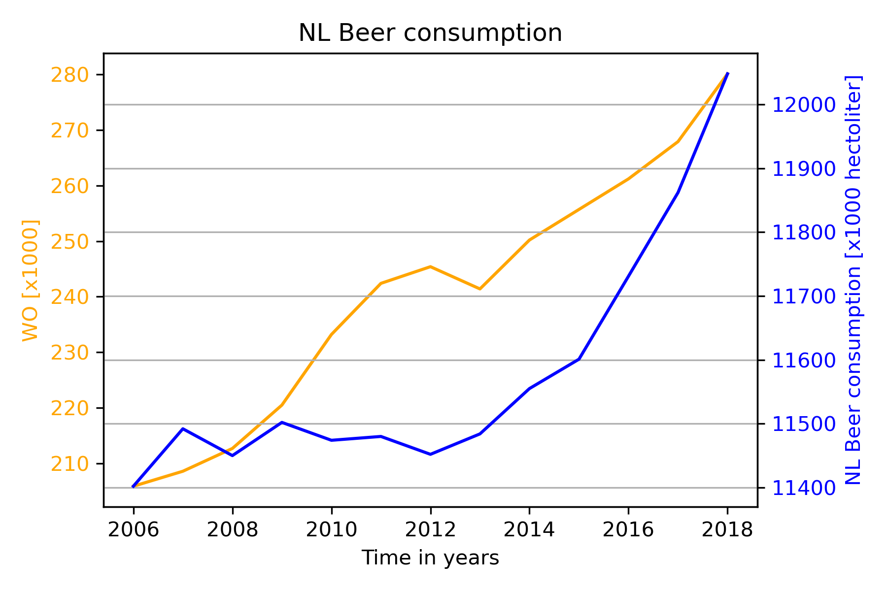

# CS_Assignment Solution

*David Puroja - 10469036*

## Title of 3 papers

  - MCC Van Dyke et al., 2019: **Fantastic yeasts and where to find them: the hidden diversity of dimorphic fungal pathogens**
  - JT Harvey, Applied Ergonomics, 2002: **An analysis of the forces required to drag sheep over various surfaces**
  - DW Ziegler et al., 2005: **Correlation of continuous cardiac output measured by a pulmonary artery catheter versus impedance cardiography in ventilated patients**

## Plot of isthereacorrelation.csv

The data of the csv is shown in Figure 1:

*Figure 1: NL Beer consumption in the years against parameter WO.*